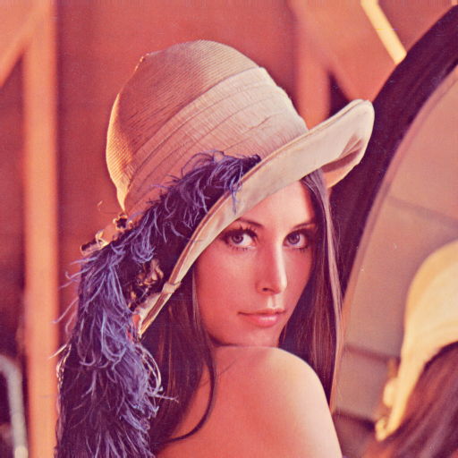

## Classical Vision

#### 1 Convolution and Filter

##### Run

```bash
python convolve.py
```

##### Results

| Lenna_original                                               | gaussian_keral                                               | sharpening_ker                                               | sobel_kernel_x                                               | sobel_kernel_y                                               |
| ------------------------------------------------------------ | ------------------------------------------------------------ | ------------------------------------------------------------ | ------------------------------------------------------------ | ------------------------------------------------------------ |
|  |  |  |  |  |

#### 2 Canny edge detector

##### Algorithm

###### (a) Compute the Image Gradient

$$
\mathbf{M} = \sqrt{\left(\frac{\partial I}{\partial x}\right)^2 + \left(\frac{\partial I}{\partial y}\right)^2}\\

\mathbf{D} = \arctan\left(\frac{\partial I}{\partial y} \cdot \frac{\partial x}{\partial I}\right)\\
$$

###### (b) Non-Maximal Suppression

   - Let $M_{i,j}$ be the gradient magnitude at pixel $(i,j)$.  
   - Let $D_{i,j}$ be the gradient direction at pixel $(i,j)$.  
   - Compare $M_{i,j}$ with the magnitudes of the two neighboring pixels along the direction perpendicular to $D_{i,j}$.  
   - If $M_{i,j}$ is greater than both neighbors, retain it; otherwise, set $M_{i,j} = 0$.

###### (c) Edge Thinning

The edges resulted from NMS are often too thin and may not be connected. To link the potential
discontinuous edges, we should do edge linking. 

##### Run

```bash
python canny.py
```

##### Results

I feel something went wrong...

| 1                                                            | 2                                                            | Expected                                                     |
| ------------------------------------------------------------ | ------------------------------------------------------------ | ------------------------------------------------------------ |
|  |  |  |

#### Harris Corner Detector

#### Run

```bash
python harriscorner.py
```

#### Result


#### RANSAC: Line Fitting

##### Run

```bash
python harriscorner.py
```

##### Result


