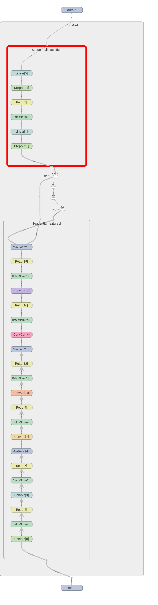
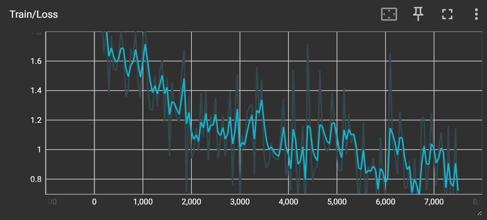
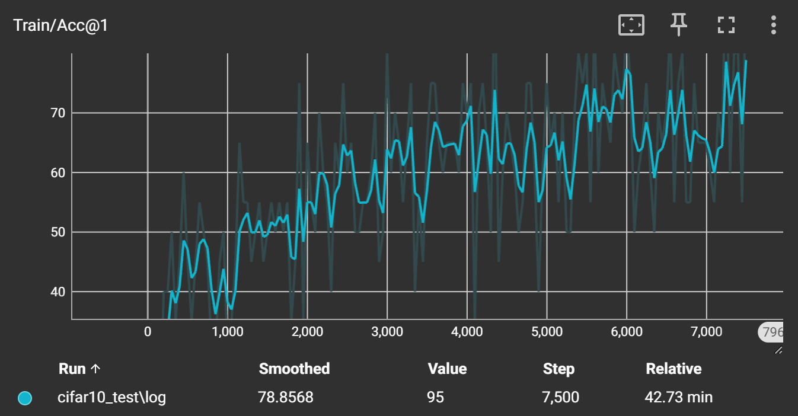
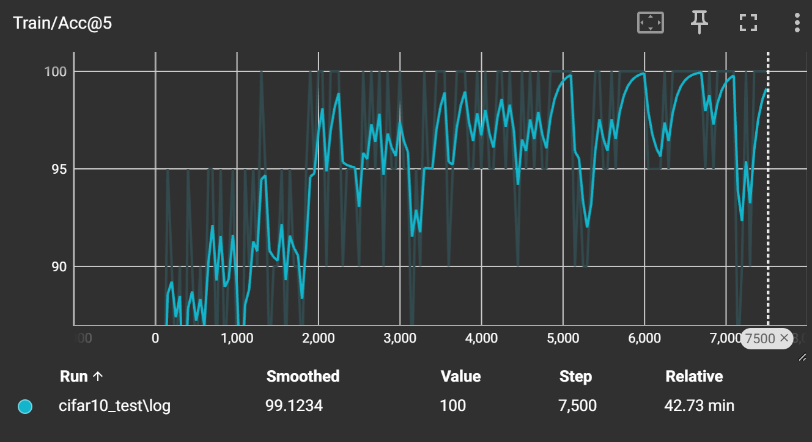

## PA2 Deep Vision

```bash
conda activate ./hw2_env
```

### Visualization

- Visualize the structure of network
```bash
cd cifar-10
python network.py
cd ../experiments
tensorboard --logdir .
```



- Visualize and check the input data

```bash
cd cifar-10
python dataset.py
```

| Origin                                                       | 1                                                            | 2                                                            |
| ------------------------------------------------------------ | ------------------------------------------------------------ | ------------------------------------------------------------ |
|  |  |  |


- Train network and visualize the curves

```bash
cd cifar-10
python train.py
cd ../experiments
tensorboard --logdir .
```

| Loss                                                         | Acc@top1                                                     | Acc@top5                                                     |
| ------------------------------------------------------------ | ------------------------------------------------------------ | ------------------------------------------------------------ |
|  |  |  |
