[TOC]

# Computer Vision: Overview

> Notes taker: Alex
>
> Contact: `wang-zx23@mails.tsinghua.edu.cn`
>
> Reference: `Prof. Yali Li 's PPT Lecture1-2` `Prof. He Wang's PPT Lecture1-2`

## **0 Overview**

### 0.1 Traditional 

The history and development of Computer Vision (CV) can be summarized through several key milestones, focusing on mathematical foundations, coding practices, and model advancements. Below is a detailed overview:

- **Biological Vision and Neuroscience (19th-20th centuries)**

  - The study of human vision and biological mechanisms laid the groundwork for understanding how visual information is processed. Early research in neurophysiology and psychology provided insights into visual perception, which inspired computational models.

    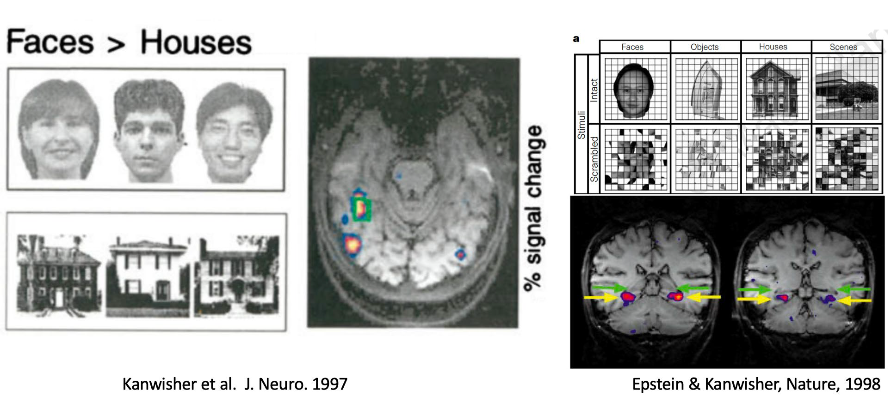

- **Marr's Computational Vision (1970s-1980s)**

  - David Marr proposed a three-level framework for understanding vision:

    - **Computational Theory**: What does the system do?

    - **Representation and Algorithm**: How does it do it?

    - **Hardware Implementation**: How is it implemented in the brain?
    - 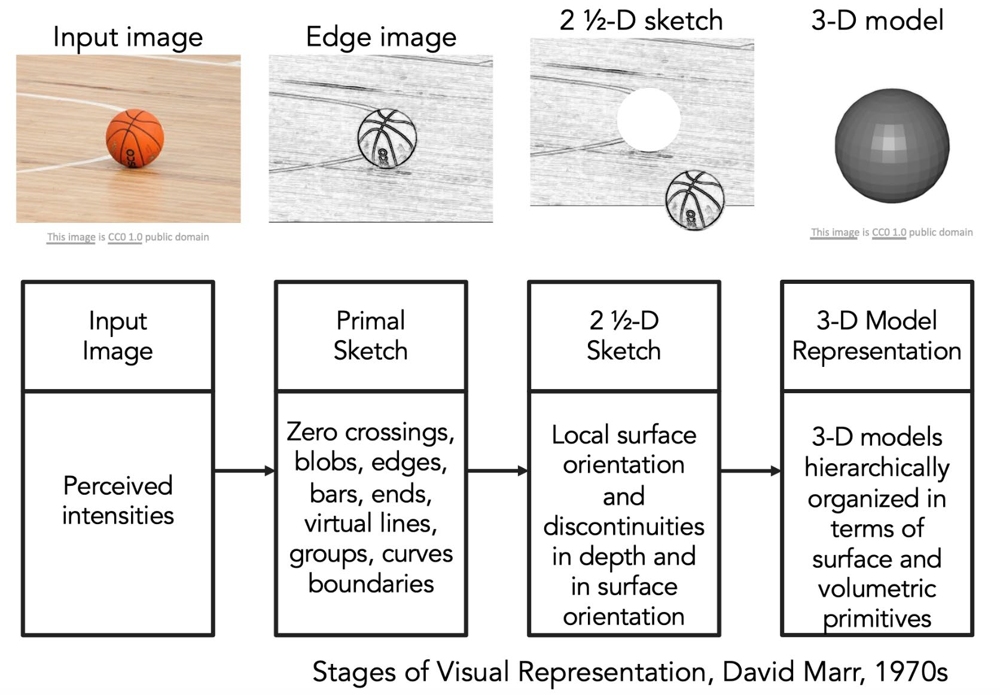

  - This work emphasized the importance of mathematical modeling and hierarchical processing in vision.

- **Early Algorithms and Feature Detection**

​	**SIFT (Scale-Invariant Feature Transform)**: Introduced by David Lowe in 1999, SIFT detects and describes local features in images. It is robust to scale changes and rotations.

```
https://www.cs.ubc.ca/%7Elowe/papers/iccv99.pdf
```

​	**HOG (Histogram of Oriented Gradients)**: Developed by Navneet Dalal and Bill Triggs in 2005, HOG is used for object detection, particularly for human detection. It captures the distribution of gradient orientations in an image.

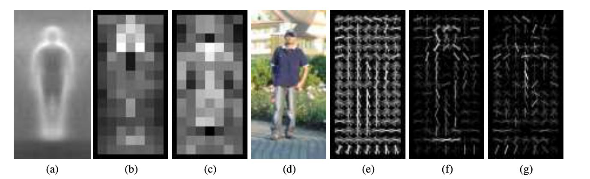

### 0.2 Modern (ML, DL rise)
- **Feature Engineering and Traditional Methods (1990s-2000s)**

  - **Boosting Algorithms**: Techniques like AdaBoost combined weak classifiers to form strong classifiers, improving object detection.

  - **Support Vector Machines (SVM)**: SVMs were widely used for classification tasks, leveraging kernel methods to handle non-linear data.

- **Deep Learning and Convolutional Neural Networks (CNNs)**

  - **LeNet (1998)**: Yann LeCun's LeNet was one of the earliest CNNs, used for handwritten digit recognition. It demonstrated the potential of neural networks for image classification.

  - **ImageNet Challenge (2010-2017)**: The **ImageNet** Large Scale Visual Recognition Challenge (ILSVRC) spurred significant advancements in CV. **AlexNet** (2012) by Alex Krizhevsky et al. achieved state-of-the-art performance using deep CNNs, leading to widespread adoption of deep learning in CV.
  - 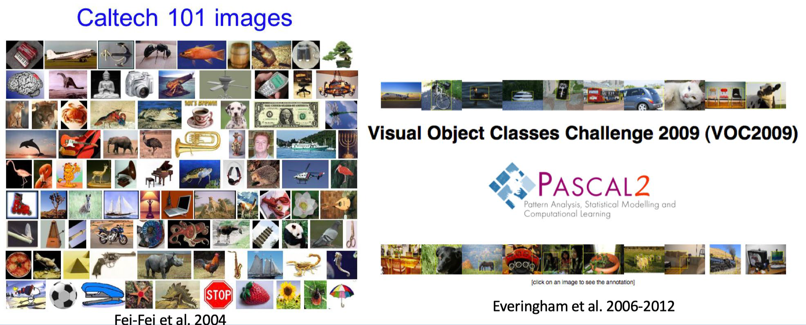
  - 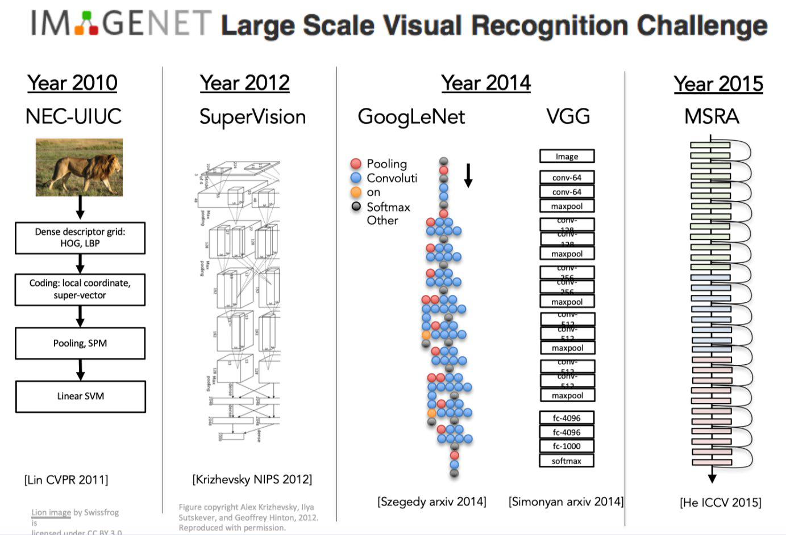

  - **VGGNet, GoogLeNet, and ResNet**: These architectures further improved performance by introducing deeper and more complex network structures. **ResNet**, in particular, introduced residual connections to ease the training of **very deep networks**.
  - 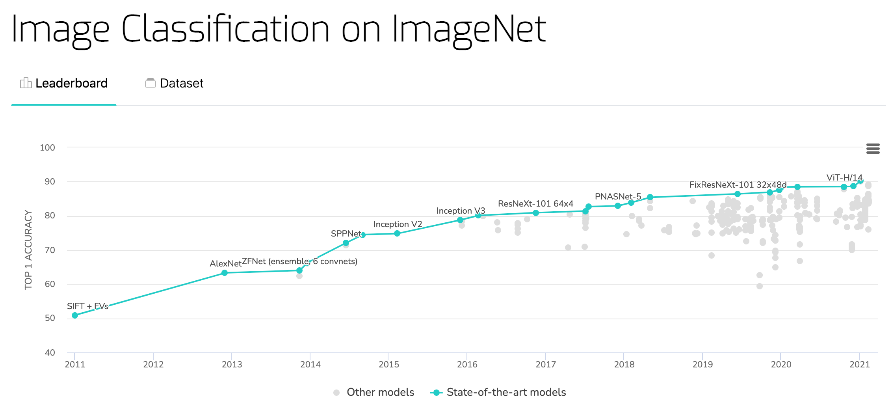

### 0.3 SOTA Models
- **Transformer-Based Models**

  - **Vision Transformer (ViT)**: Introduced in 2020, ViT adapted the Transformer architecture, originally designed for natural language processing, to computer vision tasks. It processes images as sequences of patches and has shown strong performance in image classification.

  - **Swin Transformer**: An improvement over ViT, Swin Transformer uses hierarchical representations and shifted windows to enhance computational efficiency and performance.

- **Multi-Modal Models and Vision-Language Integration**

- 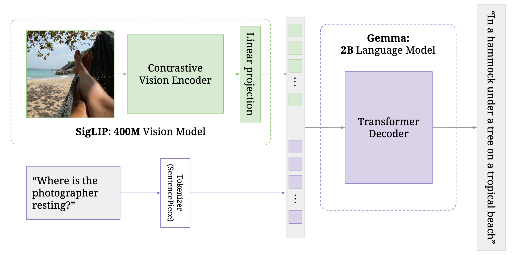

  - **CLIP (Contrastive Language-Image Pre-training)**: Introduced by OpenAI in 2021, CLIP aligns text and image embeddings, enabling zero-shot classification and other vision-language tasks.
  - 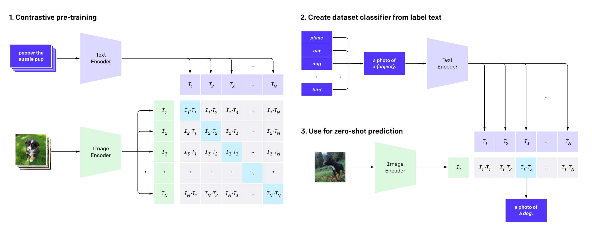

  - **SAM (Segment Anything Model)**: Developed by Meta AI, SAM allows users to segment objects in images using simple inputs like clicks or bounding boxes. It represents a significant advancement in interactive segmentation.
  - 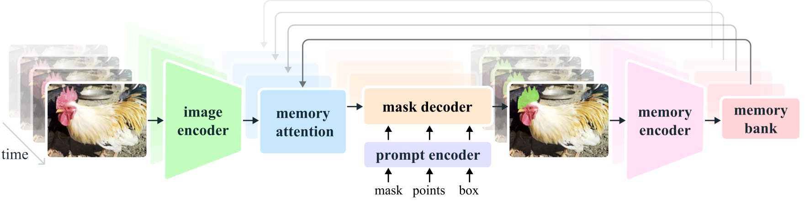
  - **Florence-2: Advancing a Unified Representation for a Variety of Vision Tasks**
  - 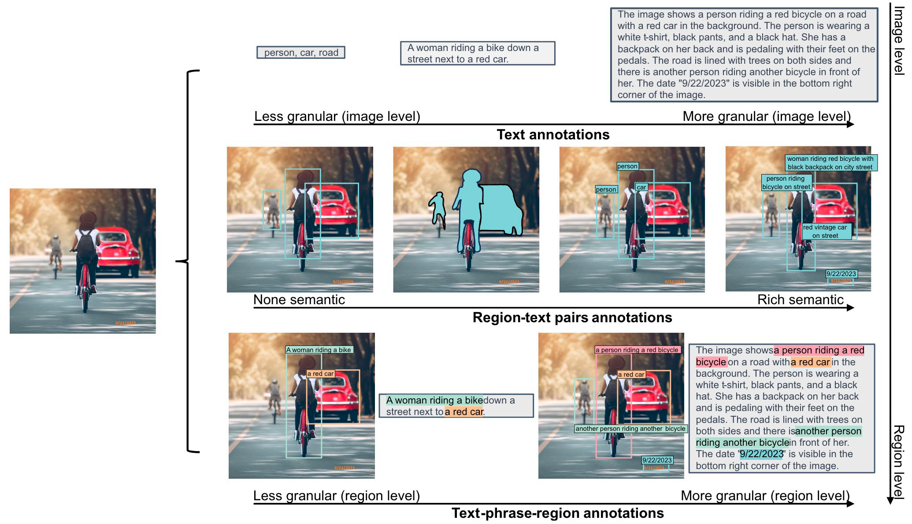

- **Large Language Models and General AI**

  - **DeepSeek-V3**: A large-scale model with 671 billion parameters, it demonstrates the potential of extremely large models for multi-modal tasks, combining vision and language capabilities.
    - **Multi-Head Latent Attention+DeepSeekMoE: Training Strong Models at Economical Costs**
  - 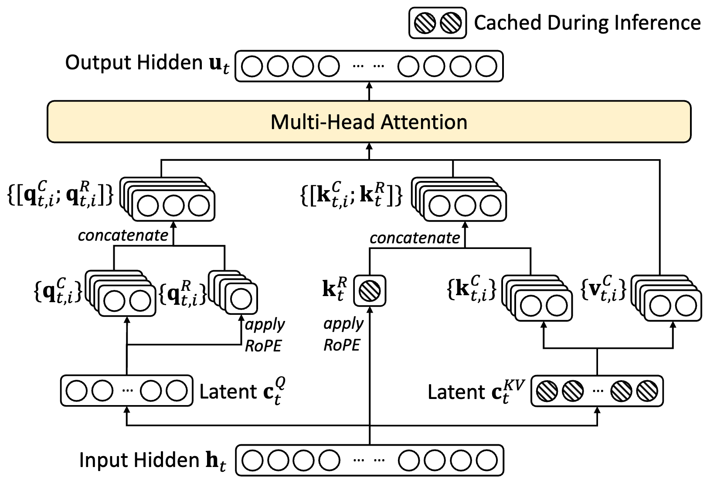
  - 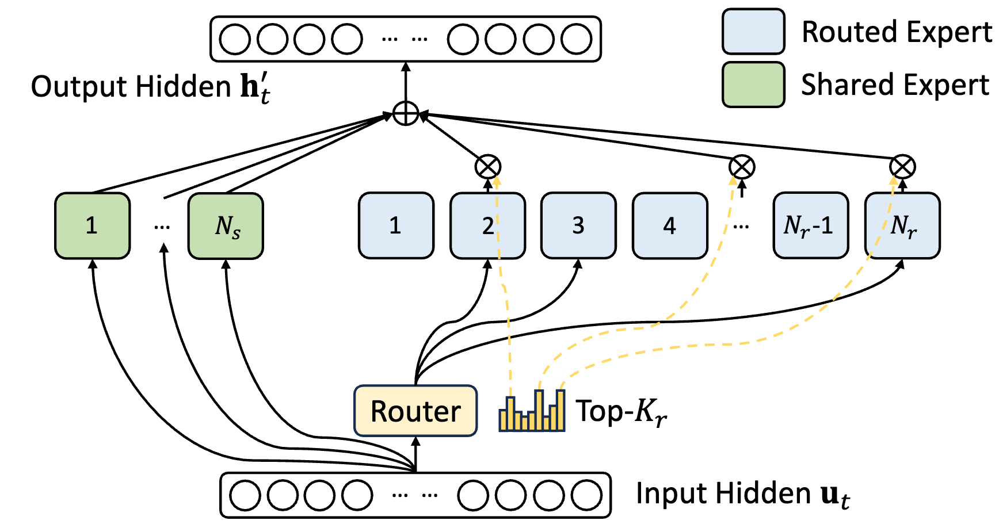

  - **Sora**: A video generation model that can create high-fidelity videos from text prompts, showcasing advancements in generative AI for visual content.

## **1 Image & Video Processing**

> **Formulation**: An image can be seen as a function $f$ that maps from $\mathbb{R}^2$ to $\mathbb{R}^M$, where $f(x,y)$ gives the intensity at position $(x,y)$,while video is image with the dimension of time,which can be described as $f(x, y, t)$

Several common image and video processing techniques are described below.

### 1.1 Image

#### 1.1.1 Histogram

##### Properties

- Only statistical information about image, but stable.
- Histograms plots how many times(frequency)
  each intensity value in image occurs
- No indication of location of pixels. Different images can have same histogram
- Same histogram = same statistics, but distribution of intensities could be different.

##### Applications

- Brightness

Brightness of a grayscale image is the average intensity of all pixels in image. That $B(I) = \frac{1}{wh}\sum_{v = 1}^h\sum_{u = 1}^{w}I(u, v)$

- Image Enhancement

A histogram can be used to improve the contrast of an image. By stretching or compressing the histogram, pixel values can be adjusted, making dark regions lighter or bright regions darker. Here's a simpler summary of histogram applications in image processing:

###### Histogram Equalization

- Takes dark or low-contrast images and makes them clearer
- Spreads out the brightness levels evenly
- Shows up as a transformation from uneven histogram to more uniform distribution

###### Dynamic Range Compression

- Helps balance very bright and very dark areas in the same image
- Uses logarithmic function to compress the range
- Makes details visible in both dark and bright regions

###### Gray-level Slicing

- Highlights specific brightness ranges you're interested in
- Like using a highlighter to mark important parts of the image
- Useful when you want to focus on particular features

Think of it like:
- Histogram Equalization = Improving overall contrast
- Dynamic Range Compression = Making both dark and bright parts visible
- Gray-level Slicing = Highlighting specific brightness ranges

#### **1.1.2 Filtering**

Above we have described the technique of histogram image enhancement, next the image is processed using the operator.

> Definition: Form a new image whose pixels are a combination original pixel values.
>
> Goal： Extract useful information from the images (Features like: edges, corners, blobs)

##### 1D-Filter

Original data 𝑓[𝑛] * Filter 𝑔[𝑛] = After moving average ℎ[𝑛]
$$
h[n] = (f * g)[n] = \sum_{m  = - \infty}^{\infty} f[m] g[n - m]
$$

| 𝑓[𝑛]                                                         | 𝑔[𝑛]                                                         | ℎ[𝑛]                                                         |
| ------------------------------------------------------------ | ------------------------------------------------------------ | ------------------------------------------------------------ |
| 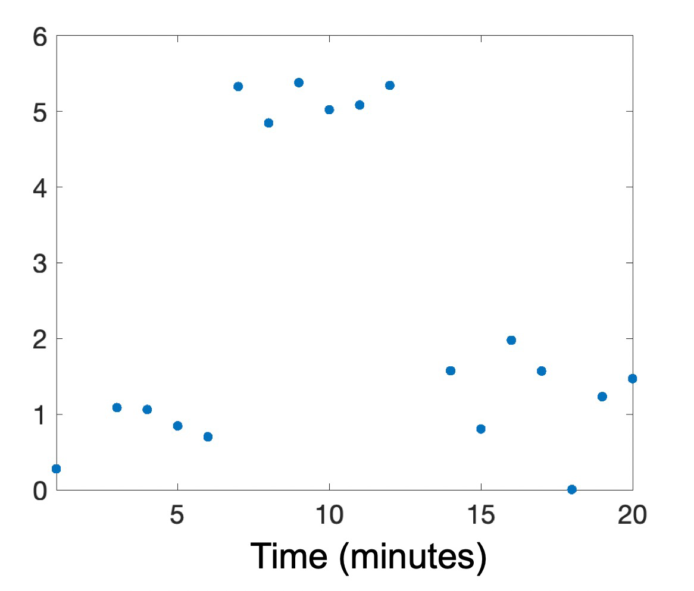 | 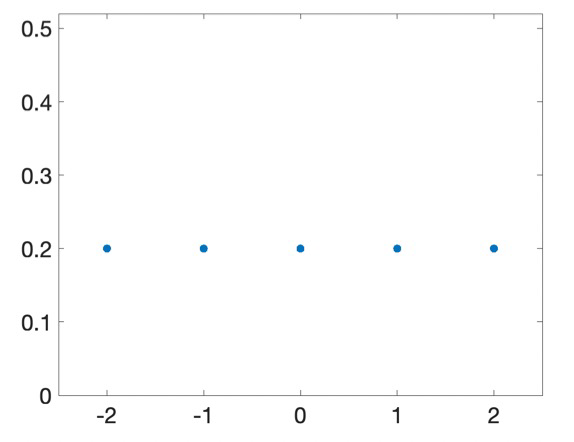 | 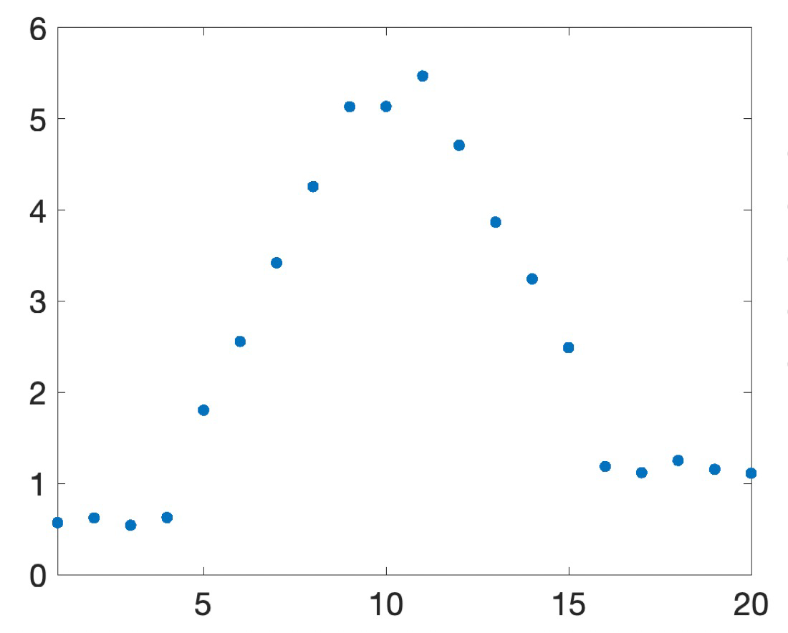 |

The reason it is called a **filter**, can be understood using the Fourier transform: ℱ(𝑔)[𝑚] mainly concentrates around 0 that 𝑔 is a low-pass filter.

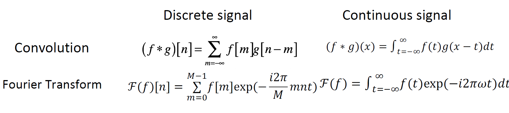

> Convolution Theorem: The convolution of two signals$f(t)$ and$ h(t) $ in the time domain is equivalent to the product of their Fourier transforms in the frequency domain. That is:
> $$
> \mathcal{F}\{f(t) * h(t)\} = \mathcal{F}\{f(t)\} * \mathcal{F}\{h(t)\}
> $$

The convolution operation is equivalent to multiplying the frequency components of the input signal with the frequency response of the filter, thereby filtering out certain frequency components or enhancing others.

|                 $g[m] \to \mathcal{F}(g)[m]$                 |
| :----------------------------------------------------------: |
| 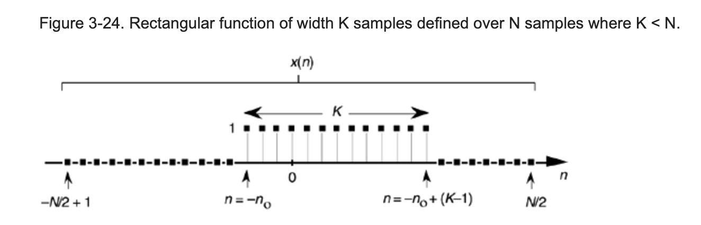 |
| 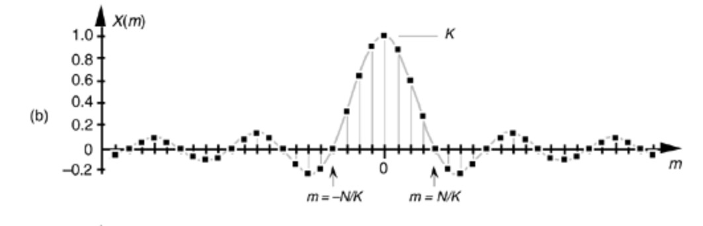 |

We can see that **convolution is linear** and can be expressed in terms of **matrix algebra**：𝑓[𝑛] → System 𝒢 → ℎ[𝑛]
$$
ℎ = 𝒢(𝑓), ℎ[𝑛] = 𝒢(𝑓)[𝑛]\\
𝒢(𝛼𝑓+ 𝛽𝑓) = 𝛼𝒢(𝑓) + 𝛽𝒢(𝑓)
$$

##### 2D-filter

Filter with the following filter:
$$
\mathcal{𝒢} = \frac{1}{9}
\begin{bmatrix}
1 & 1 & 1 \\
1 & 1 & 1 \\
1 & 1 & 1
\end{bmatrix}
 \\
ℎ[𝑚, 𝑛] = \frac{1}{9}\sum_{k = n -1}^{n + 1}\sum_{m - 1}^{m + 1}f[k,l]\\
$$
The above filter is a linear filter that can remove noise from an image. Below is an introduction to Non-linear Filtering Example: Binarization via Threshold.
$$
ℎ[𝑚, 𝑛] = \large{ \mathbb{1}}\{f[n,m] > τ\}
$$

##### Spatial Filtering

- Low pass filtering

The low pass filter is described in more detail later in this note, and can be used to filter out some of the high frequency noise components.
$$
\mathcal{𝒢} = \frac{1}{9}
\begin{bmatrix}
1 & 1 & 1 \\
1 & 1 & 1 \\
1 & 1 & 1
\end{bmatrix}
$$

- Median filtering (Band-Pass Filtering)

Band-pass filtering (?) Can a nonlinear filter be expressed as a matrix?

- Sharpening Filtering
  - Accentuates differences with local average.

A common form could be:


$$
\mathcal{𝒢} = \frac{1}{9}
\begin{bmatrix}
-1 & -1 & -1 \\
-1 & 8 & -1 \\
-1 & -1 & -1
\end{bmatrix}
$$
and other sharpening operators:
```
Laplacian Operator
[ 0  1  0]
[ 1 -4  1]
[ 0  1  0]
Sobel Operator(x)
[-1  0  1]
[-2  0  2]
[-1  0  1]
Sobel Operator(y)
[ 1  2  1]
[ 0  0  0]
[-1  2  1]
```

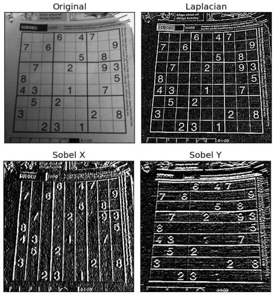

##### Frequency Domain

- The convolution operator on the null domain is not intuitive enough, we define the filtering operator on the frequency domain. $ G(w1,w2)$ is the spectrum of the output image, F(w1,w2) is the spectrum of the input image, and H(w1,w2) is the transfer function of the filter.

$$
G(w_1,w_2) = F(w_1,w_2)H(w_1,w_2)
$$

- Lowpass

$$
H(u,v) = \begin{cases} 
1, & \text{if } D(u,v) \leq D_0 \\\\
0, & \text{if } D(u,v) > D_0
\end{cases}
$$

- Bandpass:

$$
H_{BP}(u,v) = H_{HP}(u,v) \cdot H_{LP}(u,v)
$$

- Band resistance:

$$
H_{BS}(u,v) = 1 - H_{BP}(u,v)
$$


- High pass:

$$
H(u,v) = \frac{1}{1 + [D(u,v)/D_0]^{2n}}\\\
H(u,v) = e^{-D^2(u,v)/(2D_0^2)}
$$

- However! Frequency-domain filters are not used much in image processing; using a frequency-domain low-pass filter results in ripple-like noise at the edges of the image.

##### Detectors & Operators

- First-order operator: **recognizes** edge points in an image using the **gradient** of the **image density** as a supervisory signal.

$$
\mathcal{𝒢} = \frac{1}{3}
\begin{bmatrix}
1 & 0 & -1 \\
1 & 0 & -1 \\
1 & 0 & -1
\end{bmatrix}
$$


- **Second order** operator: like the sharpening operator.
- **Gaussian filter**


- 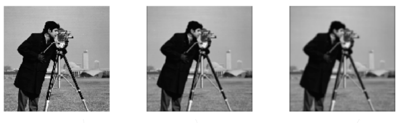

  - We want nearest neighboring pixels to have the most influence on the output.

  $$
  G(x,y) = \frac{1}{2\pi\sigma^2} e^{-\frac{x^2 + y^2}{2\sigma^2}}
  $$


#### **1.1.3 SIFT Descriptors**

> Scale Invariant Feature Transform (SIFT) is a widely used algorithm in computer vision for detecting and describing local features in images. The SIFT descriptor is particularly effective for image matching and object recognition tasks. Below is a detailed markdown note on SIFT descriptors, focusing on their mathematical formulation and the steps involved in their computation.

##### What is the Best Descriptor for an Image Feature?

Descriptors are crucial in computer vision for identifying and matching features across different images. The SIFT descriptor is one of the most robust and widely used descriptors due to its ability to handle variations in scale, rotation, and illumination.

1. **Multi-scale Extrema Detection**
2. **Keypoint Localization**
3. **Orientation Assignment**
4. **Keypoint Descriptor**

The first step in generating SIFT descriptors involves detecting extrema (points of local maximum or minimum intensity) across different scales and orientations of the image. This is achieved using a Difference of Gaussians (DoG) pyramid.

- **DoG Pyramid**: Constructed by subtracting each Gaussian smoothed image from the next scale-up smoothed image.
- **Scale-space extrema**: Points that are local maxima or minima in their 3x3x3 neighborhood in scale and orientation space.

After detecting the extrema, the next step is to precisely localize these keypoints. This involves:

- **Second Order Taylor Series Approximation**: Used to approximate the scale-space function.
- **Derivative Calculation**: The derivatives of the function are calculated to refine the location of the extrema.

$$
f(x) = f + \frac{\partial f^T}{\partial \mathbf{x}} \mathbf{x} + \frac{1}{2} \mathbf{x}^T \frac{\partial^2 f}{\partial \mathbf{x}^2} \mathbf{x}\quad
\mathbf{x} = (x,y,\sigma)\\
\mathbf{x}_m = -\frac{\partial^2 f^{-1}}{\partial \mathbf{x}^2} \frac{\partial f}{\partial \mathbf{x}} \\
$$

Each keypoint is assigned an orientation to achieve rotation invariance. This is done by:

- **Gaussian-smoothed Image**: For a keypoint, \( L \) is the Gaussian-smoothed image with the closest scale.

- **Gradient Calculation**:
  $$
  m(x, y) = \sqrt{(L(x+1, y) - L(x-1, y))^2 + (L(x, y+1) - L(x, y-1))^2} \\
  \theta(x, y) = \tan^{-1}((L(x, y+1) - L(x, y-1))/(L(x+1, y) - L(x-1, y))) \\
  $$

The orientation of the keypoint is the average of the gradient orientations in a circular window around the keypoint.

Finally, the SIFT descriptor is generated for each keypoint. This involves:

- **Histogram Construction**: A 4x4 grid of histograms is constructed around each keypoint, with each histogram having 8 bins (for a total of 128 dimensions).
- **Gradient Magnitude and Orientation**: The gradient magnitude and orientation are used to populate the histograms.

The descriptor vector for each keypoint is a 128-dimensional vector, capturing the local appearance and orientation of the image around the keypoint.

#### Traditional CV Application - DPM

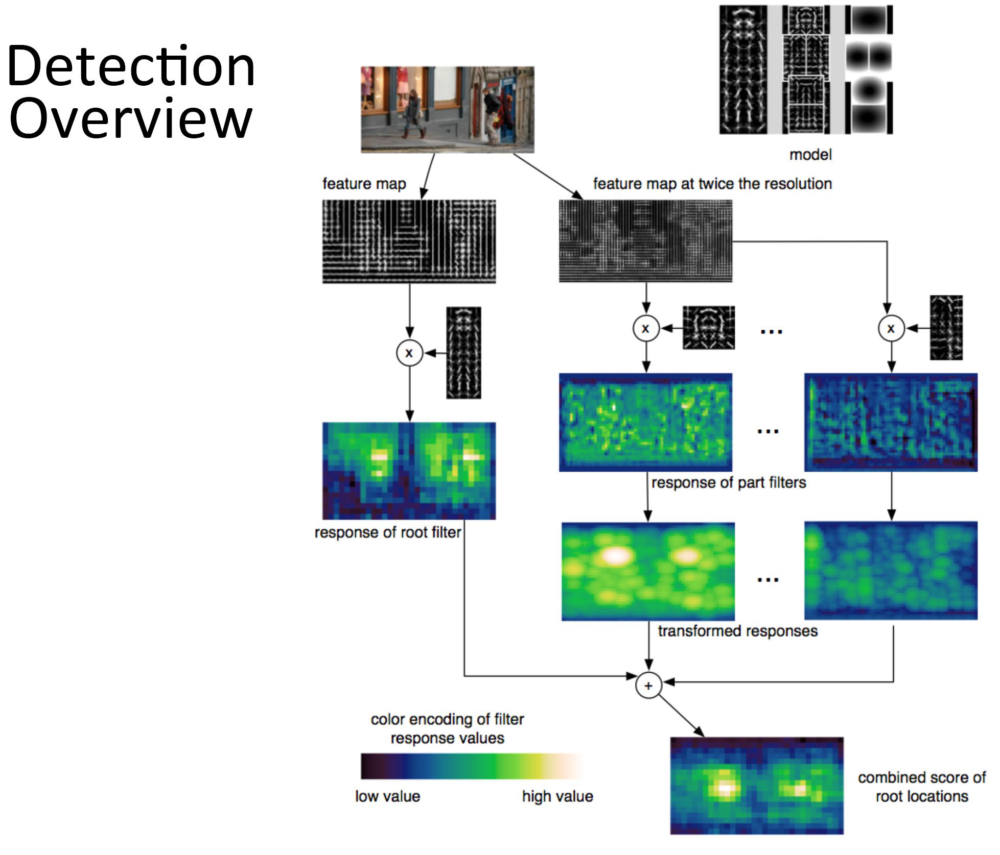

### 1.2 Video

#### 1.2.1 Representation & Compression

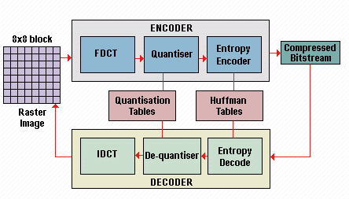

##### I-Frame (Intra Frame)

- **Characteristics**: Self-contained, independent of other frames.
- **Usage**: Acts as a reference frame; similar to a JPEG image.
- **Pros**: High quality, easy to decode.
- **Cons**: Largest file size.
- **Example Sequence**: `I → P → P → P`

##### P-Frame (Predictive Frame)

- **Characteristics**: Predicted from previous I or P frames.
- **Usage**: Stores only changes from the reference frame using motion compensation.
- **Pros**: Smaller than I-frames.
- **Cons**: Medium decode complexity.
- **Example Sequence**: `I → P → P → P`

##### B-Frame (Bidirectional Frame)

- **Characteristics**: Uses both past and future frames as references.
- **Usage**: Highest compression ratio.
- **Pros**: Most efficient in storage.
- **Cons**: Requires more processing power.
- **Example Sequence**: `I → B → B → P → B → B → P`

> Typical Frame Pattern

```
I B B P B B P B B P I ...
```

| Frame Type | Size   | Quality | Decode Complexity | Dependencies |
| ---------- | ------ | ------- | ----------------- | ------------ |
| I-Frame    | Large  | High    | Low               | None         |
| P-Frame    | Medium | Medium  | Medium            | Forward      |
| B-Frame    | Small  | Medium  | High              | Both         |

#### **1.2.2 Optical flow detector**

$$
\text{Basic: }I(x, y, t) = I(x + \Delta x, y + \Delta y,t + \Delta t)\\
 I(x + \Delta x, y + \Delta y,t + \Delta t) = I(x , y, z)+ \frac{\partial I}{\partial x}\Delta x + \frac{\partial I}{\partial y}\Delta y + \frac{\partial I}{\partial t}\Delta t + \mathcal{O}(higher prder)\\
 I_x V_x + I_yV_y = -I_t\\
$$

- To find the optical flow another set of equations is needed, given by some additional constraint. All
  optical flow methods introduce additional conditions for estimating 

  > **Lucas-Kanade Method** (Sparse, Local): It assumes that the flow is **essentially constant in a local neighborhood of the pixel** under consideration, and solves the basic optical flow equations for all the pixels in that neighborhood, by the least squares criterion.

$$
I_x(p_i)V_x + I_y(p_i)V_y = -I_t(p_i)\\
AV = b\\
A = \begin{bmatrix} 
\sum I_x(p_i)^2 & \sum I_x(p_i)I_y(p_i) \\
\sum I_x(p_i)I_y(p_i) & \sum I_y(p_i)^2
\end{bmatrix}\\
V = \begin{bmatrix} V_x \\ V_y \end{bmatrix} \quad 
b = \begin{bmatrix} 
-\sum I_x(p_i)I_t(p_i) \\
-\sum I_y(p_i)I_t(p_i)
\end{bmatrix}
$$

>The **Horn-Schunck algorithm** **assumes smoothness in the flow over the whole image**. Thus, it tries to minimize distortions in flow and prefers solutions which show more smoothness.

$$
E(du,dv) = \int\int [(I_x u + I_y v + I_t)^2 + \alpha(|\nabla u|^2 + |\nabla v|^2)]dp\\
\frac{\partial E}{\partial u} = 2((I_x^2 + \alpha L)u + I_xI_yv + I_xI_t)\\
\frac{\partial E}{\partial v} = 2(I_xI_yu + (I_y^2 + \alpha L)v + I_yI_t)\\
\begin{bmatrix} 
I_x^2 + \alpha L & I_xI_y \\
I_xI_y & I_y^2 + \alpha L
\end{bmatrix}
\begin{bmatrix}
du \\
dv
\end{bmatrix} = 
-\begin{bmatrix}
I_xI_t + \alpha Lu \\
I_yI_t + \alpha Lv
\end{bmatrix}
$$
